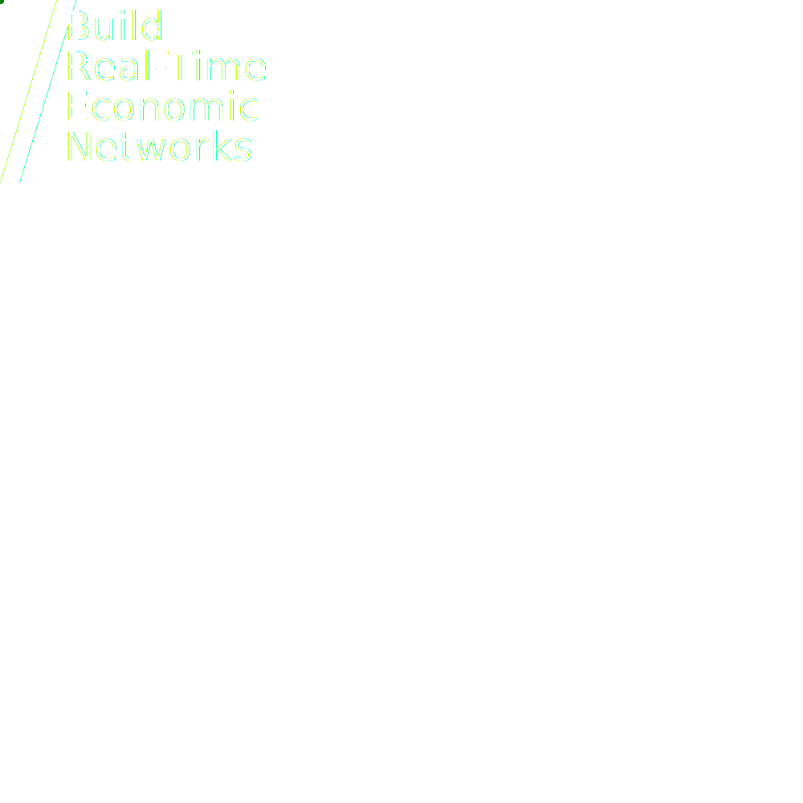

# ISO 20022 Software Developer Kit (SDK)

The `iso-20022-sdk` is a Rust library for working with ISO 20022 messages.

```toml
# Cargo.toml

[dependencies]
iso-20022-sdk = { version = "0.1.0" }

```

> #
> WARNING: This repository is actively under development. While we will do our best to maintain consistency and adequate deprecation notices, it is wise to expect breaking changes and use a static version in your dependencies.
> #

> #
> Read the [ISO 20022 SDK User Guide]() for usage examples and more information.
> #
<br/>
<br/>


> #
> Need ISO 20022 Integrations? [Contact us](mailto:ryan.tate@emergent.financial) to learn about our services.
> #

## Features

By default, `iso-20022-sdk` includes `nvlp`, `head` and `dsig` features, which imports `iso-20022-nvlp`, `iso-20022-head` and `iso-20022-dsig` respectively.

Documents, e.g. `remt.001.001.01`, are conditionally compiled and need to be added individually, either as a business domain or message set feature, e.g.

```toml
# Cargo.toml

[dependencies]
iso-20022-sdk = { version = "0.1.0", features = ["remt"] }
```

Now you can create a `Document` from the `remt.001.001.01` namespace:

```rust
use iso_20022_sdk::Document;

let mut doc = Document::from_namespace("remt.001.001.01")?;

```

### Business Domains

To include messages relevant only to the `payments` business domain, add the `payments` feature to your `Cargo.toml`:

```toml
# Cargo.toml

[dependencies]
iso-20022-sdk = { version = "0.1.0", features = ["payments"] }

```

Using the `payments` features will include all message sets in the `payments` business domain:

```toml
payments = ["acmt", "auth", "acmt", "admi", "camt", "pacs", "pain", "reda", "remt"]
```

> Available business domain `features`
> 
> - `payments`
> - `securities`
> - `trade`
> - `cards`
> - `fx`


### Message Sets

Each message set, e.g. `acmt`, has its own Rust library, e.g. `iso-20022-acmt`, which can be conditionally compiled using the `Cargo.toml` **features** flag corresponding to the message set. 


```toml
# Cargo.toml

[dependencies]
iso-20022-sdk = { version = "0.1.0", features = ["acmt", "admi"] }

```


> Available message set `features`
>
> - `acmt`
> - `admi`
> - `auth`
> - `caaa`
> - `caad`
> - `caam`
> - `cafc`
> - `cafm`
> - `cafr`
> - `cain`
> - `camt`
> - `canm`
> - `casp`
> - `casr`
> - `catm`
> - `catp`
> - `colr`
> - `fxtr`
> - `pacs`
> - `pain`
> - `reda`
> - `remt`
> - `secl`
> - `seev`
> - `semt`
> - `sese`
> - `setr`
> - `tsin`
> - `tsmt`
> - `tsrv`
<!-- 
### Account Management - [`acmt`](./acmt/)
### Administration - [`admi`](./admi/)
### Authorities - [`auth`](./auth/)
### Acceptor to Acquirer Card Transactions - [`caaa`](./caaa/)
### Card Administration - [`caad`](./caad/)
### ATM Management - [`caam`](./caam/)
### Fee collection - [`cafc`](./cafc/)
### File Management - [`cafm`](./cafm/)
### Fraud Reporting and Disposition - [`cafr`](./cafr/)
### Acquirer to Issuer Card Transactions - [`cain`](./cain/)
### Cash Management - [`camt`](./camt/)
### Network Management - [`canm`](./canm/)
### Sale to POI Card Transactions - [`casp`](./casp/)
### Settlement Reporting - [`casr`](./casr/)
### Terminal Management - [`catm`](./catm/)
### ATM Card Transactions - [`catp`](./catp/)
### Collateral Management - [`colr`](./colr/)
### Foreign Exchange Trade - [`fxtr`](./fxtr/)
### Business Application Header - [`head`](./head/)
### Payments Clearing and Settlement - [`pacs`](./pacs/)
### Payments Initiation - [`pain`](./pain/)
### Reference Data - [`reda`](./reda/)
### Payments Remittance Advice - [`remt`](./remt/)
### Securities Clearing - [`secl`](./secl/)
### Securities Events - [`seev`](./seev/)
### Securities Management - [`semt`](./semt/)
### Securities Settlement - [`sese`](./sese/)
### Securities Trade - [`setr`](./setr/)
### Trade Services Initiation - [`tsin`](./tsin/)
### Trade Services Management - [`tsmt`](./tsmt/)
### Trade Services - [`tsrv`](./tsrv/) -->

---
### DISCLAIMER

Emergent Financial, LLC and iso-20022-sdk are separate entities from the ISO® 20022 Registration Authority. The ISO 20022 Registration Authority is responsible for managing and maintaining the ISO 20022 standard, whereas Emergent Financial, LLC and iso-20022-sdk are not affiliated with this organization and do not represent it in any way.

Furthermore, please note that iso-20022-sdk is provided as-is without any warranty of any kind, either express or implied. Emergent Financial, LLC and iso-20022-sdk do not make any guarantees regarding the accuracy, completeness, or reliability of the information contained in iso-20022-sdk, nor do they assume any liability for any damages or losses that may arise from the use of this software.

It is recommended that users exercise caution when using iso-20022-sdk and conduct their own independent research to assess its suitability for their particular purposes. Emergent Financial, LLC and iso-20022-sdk shall not be held liable for any direct, indirect, incidental, consequential, or other damages arising from the use of iso-20022-sdk or any other software provided by Emergent Financial, LLC.

---

Copyright 2023 Emergent Financial, LLC - All Rights Reserved